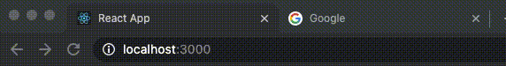

# react-use-please-stay

A classic JQuery functionality which brought animated title when you left a browser tab open but weren't on the page - ported to a React hook!



# Get Started

Install and save this package as a dependency:

```bash
npm install --save react-use-please-stay
```

Import the hook with:

```tsx
import { usePleaseStay } from 'react-use-please-stay';
```

Use it within your functional component! (It has return type of `void`, so you can just call it):

```tsx
usePleaseStay({ titles: ["Don't go!", 'We have React hooks!'] });
```

# Options

Options for the hook are passed via an object of [type `UsePleaseStayOptions`](./src/types/UsePleaseStayOptions.ts).

# Examples

Minimal example, passing the single required option `titles`:

```tsx
function App() {
  usePleaseStay({ titles: ["Don't go!", 'We have React hooks!'] });
  return (
    <>
      <h1>usePleaseStay</h1>
      <p>
        An example of the usePleaseStay hook. Leaving this browser tab open, navigate
        or open another tab and watch the magic happen!
      </p>
    </>
  );
}

export default App;
```

Loop through multiple messages:

```tsx
usePleaseStay({
  titles: ["Don't go!", 'We have React hooks!', "We're sad!", 'Come back!'],
});
```

Pass a single message and set the `animationType` option to `AnimationType.CASCADE` to cascade the letters (default is `AnimationType.LOOP`):

```tsx
usePleaseStay({
  titles: ["React App"],
  animationType: AnimationType.CASCADE
});
```

Optionally specify a slower interval time in milliseconds (default is `1000`):

```tsx
usePleaseStay({
  titles: ["Don't go!", 'We have React hooks!', "We're sad!", 'Come back!'],
  interval: 3000,
});
```

Optionally add in one or more favicon URIs to loop through each time the title changes (default is `[]`):

```tsx
usePleaseStay({
  titles: ["Don't go!", 'We have React hooks!', "We're sad!", 'Come back!'],
  interval: 3000,
  faviconURIs: ['https://redux.js.org/img/favicon/favicon.ico'],
});
```

Optionally have the animation always run with the `alwaysRunAnimations` (default is `false`):

```tsx
usePleaseStay({
  titles: ["Don't go!", 'We have React hooks!', "We're sad!", 'Come back!'],
  interval: 3000,
  faviconURIs: ['https://redux.js.org/img/favicon/favicon.ico'],
  alwaysRunAnimations: true,
});
```

That's about it for all possible configurations. Just remember that since this hook interacts with `document.title` directly it should only be called only ***once*** in your app, for example in a layout or `App` component - otherwise the title animation will not be smooth and things could get... _strange_.

# Known Issues

In some frameworks like GatsbyJS, the `document.title` is injected some time after the did mount and thus the default title returned to is sometimes wrong. This so far causes incorrect behavior only in development environments. There are no issues in the production builds.

# JQuery Implementation

For those interested, the only JQuery implementation I could find was in this [GitHub gist](https://gist.github.com/sonnm/fcaaf616e62cc46e8756599306f4e1ad#file-jquery-pleasestay-js). I'm not sure if there is an official package out there for either a vanilla JavaScript or jQuery version; I couldn't find either.
